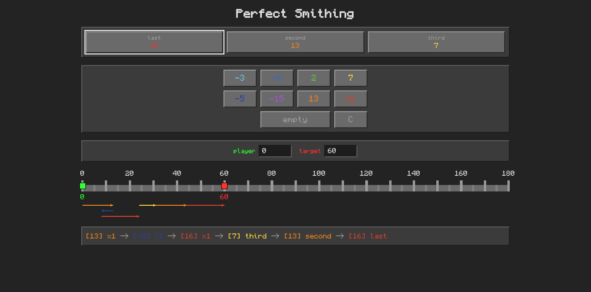

# Perfect Smithing



Shows you the perfect solution to the TerraFirmaCraft / TerraFirmaGreg smithing minigame. Coose the target position and the last hits, and get perfect hit combo.

Two ways to use it:

- **Web** — choose options visually on a minecraft-themed website and view the instantly updating solution.
- **CLI** — running `shortest-sum 60` prints the hits, with flags for other options.

## Options

- Target location, which must be reached
- Last hits, which will be accounted for
- Starting position, in case a previous smithing failed
- (Cli only) Avaiable steps and upper bound of scala.

For web, the selected option can be shared, by sharing the url.

## Algorithm

**Floyd–Warshall** all-pairs shortest paths is used for calculation:
In the implied graph, every position on the scala is a node and every hit is a directed edge of weight 1.
The algorithm gives the shortest path between any two positions in a single precomputation.
The solution is read from the reusable resulting matrix.

Finishing hits are substracted before hand.
Going below 0 - which would destroy the ingot used - is impossible, since there is no path there.

## Development

All tooling comes from the [devenv](https://devenv.sh) shell (`devenv.nix`):
`rustc`/`cargo`, `cargo-leptos`, `wasm-bindgen-cli`, `binaryen` and `lld`. Never
use a bare-shell toolchain.

```sh
devenv shell        # enter the shell or append one-off command
devenv up           # run the dev server as a *devenv process* without entering
```

Inside `devenv shell`, the dev command is:

```sh
cargo leptos watch  # build + serve + reload on change
```

It serves <http://127.0.0.1:3030> (and letpos' reload port `3031`).
Use `cargo leptos serve` for a run without watching files.
